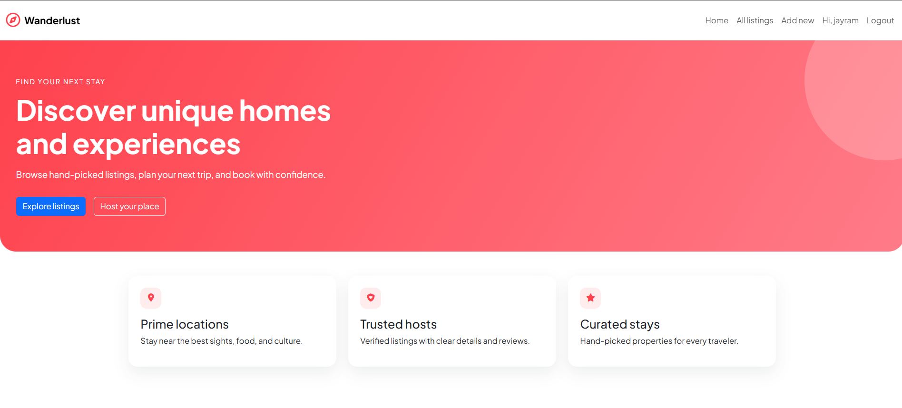
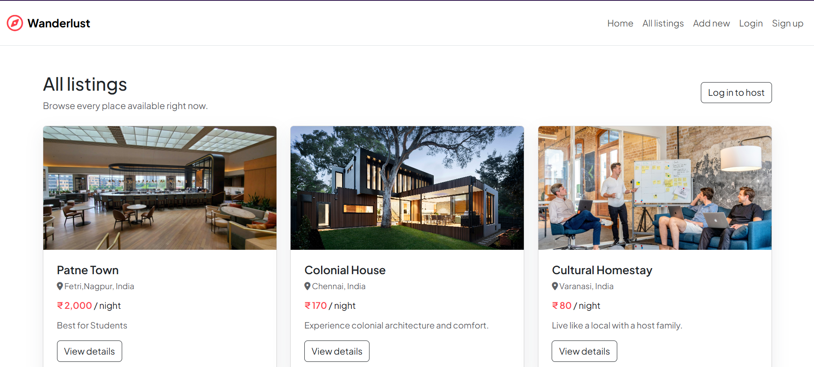
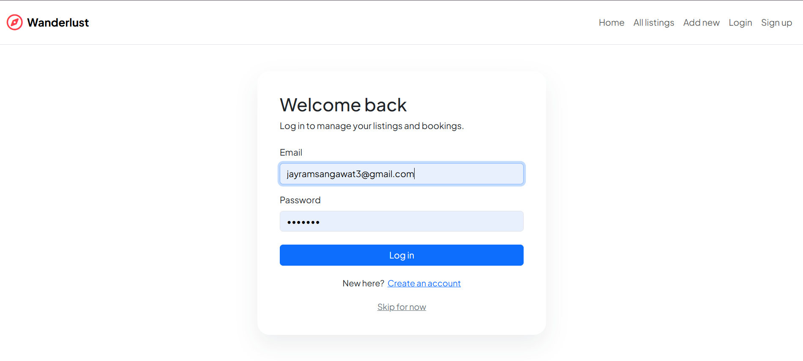
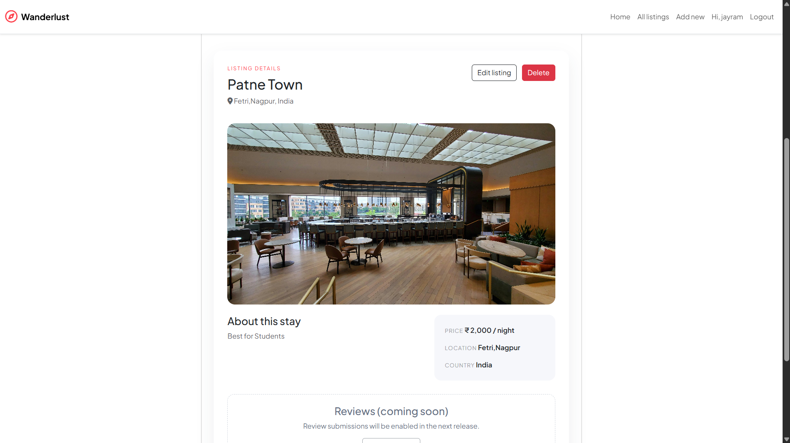

# Wanderlust (Airbnb DB Project)

A friendly, simple Airbnb-style listings app built for learning and portfolio use. Explore stays, add listings, and manage details with a clean, responsive UI.

Live demo: https://air-bnb-db-project-beta.vercel.app/

## Features

- Browse curated listings with prices and locations
- Create, edit, and delete listings
- Responsive, mobile-friendly design
- Clean UI with modern styling

## Screenshots

## Getting Started

1. Install dependencies:
   npm install
2. Run the app:
   npm run dev
3. Open in browser:
   http://localhost:3000

## Environment

Create a .env file with:

- MONGO_URL
- PORT
- SESSION_SECRET

## Improvements

This project is in improvement. Track updates and check the live build here:
https://air-bnb-db-project-beta.vercel.app/

## Made With Love

Made with love by Jayram.
